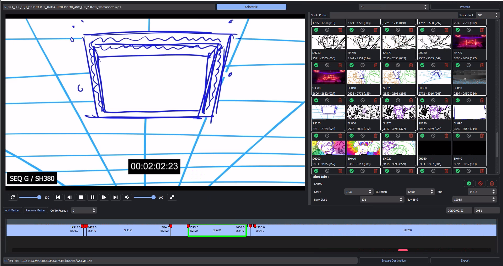

# Wolverine - Timeline Splitter

Wolverine is used to split sequences and animatics into shots, using ffmpeg and OpenTimelineIO. Users provide a timeline file (from all formats supported by OTIO) or a video file and using wolverine end up with separate shots (as separate video, audio et thumbnail files) as well as an .edl, an .xml and .otio files. The point being to have the split shots, tagged and able to be used as separate resources in the pipeline as well as a timeline resource that can be viewed, updated and transferred between the various software used in a pipeline.

This is very much an wip/early version and contains multiple bugs and still has a lot of missing features (working on it mostly in my free time), the code could also use a some clean up. Wolverine is currently also used at Brunch Studio where I work.

    

